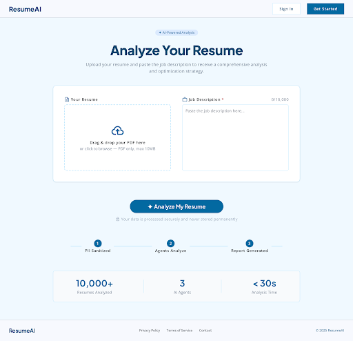
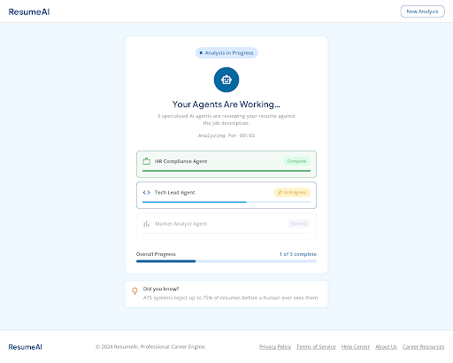
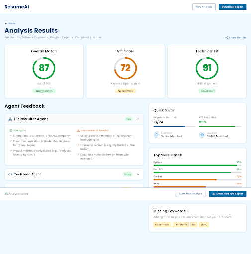

# ResumeAI — AI-Driven Resume & Job Match Analyzer

> Upload a resume + a job description. Three specialized AI agents grade the fit, surface missing keywords, predict market position, and hand back an actionable report — in under 30 seconds.

🌐 **Live demo:** https://frontend-kappa-lyart-79.vercel.app

---

## Screenshots

| Upload | In progress | Results |
|---|---|---|
|  |  |  |

---

## How it works

```
User (browser)
  │
  │  PDF resume + job description
  ▼
Next.js frontend (Vercel)
  │
  │  POST /api/v1/analyze-resume  (Bearer token if signed in)
  ▼
FastAPI backend (Render)
  │
  ├─ Parse PDF        — LlamaParse (paid) or pypdf (fallback)
  ├─ Sanitize PII     — regex redaction (email / phone / SSN / URLs / handles)
  │
  ▼
LangGraph pipeline (sequential, structured-output enforced)
  │
  ├─ HR Agent              → ATS match, keywords, ats_score
  ├─ Tech Lead Agent       → technical depth, gaps, technical_score
  └─ Market Analyst Agent  → market position via Tavily/DDG, market_fit_score
  │
  ▼
Aggregator                  weighted: HR 40% + Tech 40% + Market 20%
  │                          minus -2 per missing keyword (max -20)
  ▼
Persist to Supabase + return AnalysisResult
  │
  ▼
Frontend renders results · share link · PDF download (auth-only)
```

---

## Tech stack

### Backend (`/backend`)
| Layer | Choice | Why |
|---|---|---|
| Web framework | **FastAPI 0.115** | async, pydantic-native, OpenAPI free |
| Agent orchestration | **LangGraph 1.2** | typed state graph, easy to extend |
| LLM | **Groq · Llama 3.3 70B Versatile** (`langchain-groq`) | fast tokens, generous free tier |
| Structured output | **Pydantic 2.13** + `with_structured_output` | one source of truth for schemas |
| PDF parsing | **LlamaParse** (optional) → **pypdf** fallback | works without paid API key |
| Web search (market data) | **Tavily** → **DuckDuckGo** fallback | live salary / demand signals |
| Storage / Auth | **Supabase** | Postgres + auth in one |
| Rate limiting | **slowapi** | per-endpoint, per-IP |
| PDF reports | **fpdf2** | dependency-light, no system deps |
| Testing | **pytest** + `pytest-asyncio` | 29 tests, runs in <1 s |

### Frontend (`/frontend`)
| Layer | Choice |
|---|---|
| Framework | **Next.js 16** (App Router, Turbopack) |
| Language | **TypeScript 5** (strict mode) |
| Styling | **Tailwind CSS 4** |
| UI primitives | **lucide-react** icons + custom glassmorphism components |
| Auth | **@supabase/supabase-js** (email + Google OAuth) |
| Runtime | React 19 |

### Infrastructure
| | |
|---|---|
| Frontend hosting | Vercel |
| Backend hosting | Render (Python web service) |
| Database / Auth | Supabase |
| CI | GitHub Actions — backend pytest + frontend lint+build on every push/PR to `main` |

---

## Repository structure

```
.
├── backend/                    FastAPI service
│   ├── app/
│   │   ├── main.py             app factory · CORS · slowapi
│   │   ├── limiter.py          slowapi singleton
│   │   ├── agents/
│   │   │   ├── state.py        TypedDict state passed between nodes
│   │   │   ├── graph.py        LangGraph compile + aggregator
│   │   │   ├── hr_agent.py     ATS / keyword node
│   │   │   ├── tech_agent.py   tech depth node
│   │   │   └── market_agent.py market + search node
│   │   ├── api/v1/routes.py    5 endpoints (analyze, list, get, report, health)
│   │   ├── schemas/response.py AnalysisResult pydantic model
│   │   └── services/
│   │       ├── pdf_parser.py   LlamaParse / pypdf
│   │       ├── pii_sanitizer.py
│   │       ├── storage.py      Supabase client + CRUD
│   │       └── report_generator.py
│   ├── tests/                  29 tests (api, sanitizer, market, aggregator)
│   ├── supabase_setup.sql      schema + RLS policies
│   ├── render.yaml             Render deploy config
│   └── requirements.txt
│
├── frontend/                   Next.js app
│   ├── app/
│   │   ├── layout.tsx          AuthProvider · fonts
│   │   ├── page.tsx            home — upload + analyze flow
│   │   ├── auth/page.tsx       sign in / sign up / OAuth
│   │   ├── history/page.tsx    past analyses (auth required)
│   │   └── results/[id]/       public share-by-UUID page
│   ├── components/
│   │   ├── UploadForm.tsx
│   │   ├── AgentProgress.tsx
│   │   └── AnalysisResults.tsx
│   ├── context/AuthContext.tsx Supabase session provider
│   ├── lib/
│   │   ├── api.ts              typed fetch wrappers
│   │   └── supabase.ts         client (with env validation)
│   ├── types/analysis.ts
│   └── package.json
│
├── docs/screenshots/           README assets
├── .github/workflows/ci.yml    backend + frontend CI
└── README.md
```

---

## API

All endpoints are versioned under `/api/v1`. Rate limits are per remote IP.

| Method | Path | Auth | Rate limit | Notes |
|---|---|---|---|---|
| `GET` | `/health` | — | — | static OK |
| `POST` | `/api/v1/analyze-resume` | Optional Bearer | 20 / hour | anonymous OK; user_id attached if token present |
| `GET` | `/api/v1/analyses` | Required Bearer | 60 / hour | list current user's analyses |
| `GET` | `/api/v1/results/{id}` | Public | 120 / hour | shareable by UUID |
| `POST` | `/api/v1/generate-report` | Required Bearer | 30 / hour | renders the report as a PDF |

### Response shape
```jsonc
{
  "analysis_id": "uuid",
  "overall_score": 0-100,
  "missing_keywords": ["..."],
  "matched_keywords": ["..."],
  "strengths": ["..."],
  "agent_feedback": {
    "hr_agent":            { "score": 0-100, "summary": "...", "details": ["..."] },
    "tech_lead_agent":     { "score": 0-100, "summary": "...", "details": ["..."] },
    "market_analyst_agent":{ "score": 0-100, "summary": "...", "details": ["..."] }
  },
  "priority_improvements": [{ "text": "...", "priority": "HIGH|MEDIUM|LOW" }],
  "action_items":          [{ "text": "...", "priority": "HIGH|MEDIUM|LOW" }],
  "skills_coverage":       { "Python": 90, "Docker": 70 },
  "quick_stats": {
    "total_keywords": 0,
    "match_rate": 0-100,
    "experience_gap": "string",
    "salary_range":   "string"
  }
}
```

---

## Run locally

### Prerequisites
- Python ≥ 3.12, Node ≥ 20, a Supabase project, a Groq API key.

### Backend
```bash
cd backend
python -m venv venv && source venv/bin/activate
pip install -r requirements.txt
cp .env.example .env       # then fill in SUPABASE_URL, SUPABASE_SERVICE_KEY, GROQ_API_KEY, ALLOWED_ORIGINS
# Optional: TAVILY_API_KEY (live market data) · LLAMA_CLOUD_API_KEY (better PDF parsing)
./start.sh                 # or: uvicorn app.main:app --reload
```

Apply the schema once: open Supabase Dashboard → SQL Editor and run `backend/supabase_setup.sql`.

### Frontend
```bash
cd frontend
cp .env.example .env.local # then fill in NEXT_PUBLIC_API_URL + NEXT_PUBLIC_SUPABASE_*
npm install
npm run dev
```

Open http://localhost:3000.

### Tests
```bash
cd backend && pytest        # 29 tests, <1 s
cd frontend && npm run lint && npm run build
```

---

## Deployment

| Service | Where | Notes |
|---|---|---|
| Frontend | Vercel | auto-deploy from `main`; if it doesn't fire, run `vercel --prod` |
| Backend | Render | auto-deploy from `main`; cold start ~50 s on free tier |
| DB / Auth | Supabase | service key on backend bypasses RLS; anon key on frontend |

Environment variables required:

| Frontend (Vercel) | Backend (Render) |
|---|---|
| `NEXT_PUBLIC_API_URL` | `SUPABASE_URL` |
| `NEXT_PUBLIC_SUPABASE_URL` | `SUPABASE_SERVICE_KEY` |
| `NEXT_PUBLIC_SUPABASE_ANON_KEY` | `GROQ_API_KEY` |
|  | `ALLOWED_ORIGINS` *(comma-separated)* |
|  | `TAVILY_API_KEY` *(optional)* |
|  | `LLAMA_CLOUD_API_KEY` *(optional)* |

---

## Security model

- **PII redaction** runs before any text reaches the LLM (email, phone, SSN, URLs, handles).
- **Anonymous analysis allowed**, but auth is required to list past analyses or render PDFs.
- **Public results endpoint** is intentional — UUIDs are the capability (share-by-link).
- **Rate limits** on every authenticated/expensive route (see API table).
- **CORS** explicitly restricted to known origins; methods limited to GET/POST/OPTIONS; headers limited to `Authorization` and `Content-Type`.
- **No secrets in git** — `.env`, `.env.local`, `.mcp.json` are gitignored and verified untracked.

---

## License

Not yet specified — add one before public reuse.
